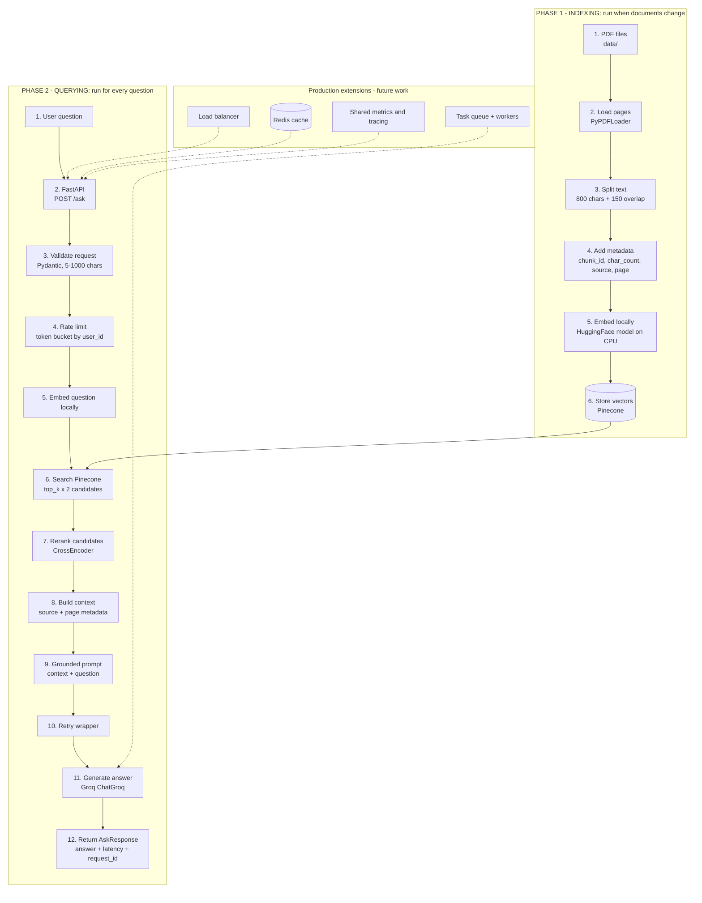

# RAG-Powered Knowledge Base Chatbot

A document-grounded question-answering API built with **FastAPI**, **LangChain**, **Pinecone**, **BM25 utilities**, **BGE embeddings**, and **Groq**. The project turns PDF documents into searchable chunks and uses the most relevant chunks as context for an LLM answer.

This repository is the working prototype described by the supplied RAG implementation and production-design guides. The core RAG path is implemented and tested offline where possible. Some production components from the guides are intentionally marked as future work below.

## What This Project Does

The RAG pipeline has two phases. The first phase prepares the knowledge base. The second phase uses that knowledge base to answer a user question. This separation is important: indexing is performed when documents change, while querying happens for every request.

The current implementation is a small, production-minded prototype. It already keeps expensive model setup outside the request handler and separates ingestion from serving. Production infrastructure such as Redis, queues, replicas, and a load balancer is shown as a future extension, not as an implemented feature.



### How to Read the Two Phases

**Phase 1: Indexing.** `uv run ingest` loads PDF pages, splits them into overlapping chunks, creates local embeddings, and stores the vectors in Pinecone. This phase is not repeated automatically when the API starts.

**Phase 2: Querying.** `POST /ask` validates the question, checks the in-memory rate limiter, embeds the question locally, searches Pinecone, reranks the results, formats their source metadata into context, and calls Groq. The response is returned synchronously.

The prompt is deliberately grounded: the model is told to use only the retrieved context and to return a fixed fallback sentence when the context does not contain the answer.

The dashed production extensions show how the same two-phase design can grow. A load balancer can distribute API replicas, Redis can provide shared cache and rate-limit state, workers can process slow requests asynchronously, and shared observability can collect metrics and traces. None of those extensions are implemented in the current repository.

## Current Status

### Implemented

- PDF ingestion with `PyPDFLoader`.
- Recursive character chunking with configurable size and overlap.
- Local CPU embeddings using `BAAI/bge-base-en-v1.5` by default.
- Pinecone vector storage and similarity search.
- BM25 keyword retrieval utility when chunks are passed to `HybridRetriever`.
- Reciprocal Rank Fusion utility for combining dense and BM25 results.
- Cross-encoder reranking with `cross-encoder/ms-marco-MiniLM-L-6-v2`.
- Grounded LangChain LCEL generation chain using Groq.
- Retry with exponential backoff around LLM calls.
- FastAPI endpoints for asking questions, health checks, and basic metrics.
- In-process token-bucket rate limiting by `user_id`.
- RAGAS evaluation scripts and a checked-in evaluation result file.
- Tests for chunking, document formatting, and API response behavior.

### Not implemented yet

The production architecture guide describes these components, but they are not currently wired into this repository:

- Redis exact or semantic response cache.
- Redis-backed global rate limiting.
- Background task queue and worker processes.
- HTTP `202 Accepted` job flow with polling.
- Load balancer, multiple API replicas, and autoscaling.
- Persistent metrics and dashboards such as Prometheus/Grafana.
- Full structured request tracing and production alerting.
- Docker and Docker Compose deployment files.
- GitHub Actions CI/CD and Railway deployment.
- Multi-tenant Pinecone namespaces.
- Robust document versioning and cache invalidation.

The current server executes retrieval and generation during the request. That is simple and appropriate for a prototype, but it means a slow LLM call keeps the request open and each process has its own rate-limit state. Although BM25 and RRF are implemented in `retriever.py`, the API creates `HybridRetriever()` without an `all_chunks` corpus, so the live API uses Pinecone dense retrieval followed by cross-encoder reranking.

## Repository Layout

```text
.
├── data/                         # PDF files to ingest
├── evaluation/
│   ├── testset.json              # Evaluation questions and ground truth
│   └── ragas_results.csv         # Saved RAGAS results
├── src/rag_chatbot/
│   ├── config.py                 # Environment-backed settings
│   ├── ingestion/
│   │   ├── loader.py             # PDF -> LangChain Documents
│   │   ├── chunker.py            # Documents -> overlapping chunks
│   │   ├── embedder.py           # Chunks -> Pinecone vectors
│   │   └── ingest.py             # Ingestion entry point
│   ├── retrieval/retriever.py    # Dense retrieval, optional BM25/RRF, reranking
│   ├── generation/
│   │   ├── prompts.py            # Grounding prompt
│   │   └── chain.py              # LCEL chain and retry wrapper
│   ├── api/
│   │   ├── main.py               # FastAPI application
│   │   ├── models.py             # Request and response schemas
│   │   └── middleware.py         # Token-bucket limiter
│   └── evaluation/               # Test-set generation and RAGAS scoring
├── tests/                        # Offline pytest suite
├── pyproject.toml                # Dependencies, scripts, Ruff, and pytest
└── README.md
```

## Design Choices and Tradeoffs

### Local embeddings instead of an embedding API

The default embedding model runs on CPU, so ingestion and queries do not incur an additional embedding API cost. The tradeoff is startup time, local memory usage, and slower inference than a hosted embedding service. The Pinecone index dimension must match `EMBED_DIM` (currently `768`).

### Hybrid retrieval utilities, with dense retrieval in the current API

The repository contains BM25 and RRF support for combining semantic and exact-term retrieval. However, the current API and evaluation code construct `HybridRetriever()` without loading local chunks, so BM25 is disabled there and RRF receives only the dense result list. This avoids loading a second local corpus today, but exact identifiers may benefit from enabling the optional sparse path in a future change. The cross-encoder still reranks the dense candidates.

### Character chunks with overlap

`CHUNK_SIZE=800` and `CHUNK_OVERLAP=150` are a practical starting point for general PDF text. Overlap helps preserve answers that cross chunk boundaries. More overlap improves recall but creates more vectors, more ingestion work, and more duplicated context.

### Groq for generation

Groq provides a fast hosted LLM and keeps the application server lightweight. The tradeoffs are external-service dependency, API quotas, network latency, and usage limits. The retry wrapper handles transient failures, but it is not a queue or a quota-management system.

### Synchronous FastAPI endpoint

The current endpoint is deliberately straightforward: validate, rate-limit, retrieve, generate, and return. The route function is synchronous, and `chain.invoke()` performs retrieval and generation before the response is returned. This makes the code easy to understand, but long requests can still time out under heavy load.

### In-memory rate limiter

The token bucket is dependency-free and useful for local development. Its state is lost on restart and is not shared between workers or replicas. Redis should replace it before running multiple instances.

## Requirements

- Python `>=3.11,<3.13`
- [uv](https://docs.astral.sh/uv/)
- A Pinecone account and an index configured for the embedding dimension
- A Groq API key
- Optional: a LangSmith API key for tracing

The first embedding-model and cross-encoder runs download model files and may take several minutes depending on the machine and network.

## Quick Start

### 1. Install dependencies

From the repository root on Windows PowerShell:

```powershell
uv sync
```

On macOS or Linux, use the same command after installing uv.

### 2. Configure environment variables

Create a `.env` file in the repository root. Do not commit it. `GROQ_API_KEY` and `PINECONE_API_KEY` are required settings; the remaining values shown below override the defaults in `src/rag_chatbot/config.py`.

```dotenv
GROQ_API_KEY=your-groq-key
GROQ_MODEL=llama-3.3-70b-versatile

PINECONE_API_KEY=your-pinecone-key
PINECONE_INDEX_NAME=rag-chatbot

EMBED_MODEL=BAAI/bge-base-en-v1.5
EMBED_DIM=768

LANGCHAIN_TRACING_V2=true
LANGCHAIN_API_KEY=your-langsmith-key
LANGCHAIN_PROJECT=rag-chatbot

CHUNK_SIZE=800
CHUNK_OVERLAP=150
TOP_K=4
DATA_FOLDER=data
```

Create a Pinecone index with:

- Dimension: `768`
- Metric: `cosine`
- The same name as `PINECONE_INDEX_NAME`

### 3. Add documents and ingest them

Place PDF files in `data/`, then run:

```powershell
uv run ingest
```

Ingestion loads only `.pdf` files, creates chunks, computes local embeddings, and upserts them to Pinecone in batches of 64. Other file types are skipped. Run ingestion again when documents change. The API does not automatically re-index documents at startup.

### 4. Start the API

```powershell
uv run serve
```

The API runs at `http://localhost:8000`. Interactive OpenAPI documentation is available at `http://localhost:8000/docs`.

## API Schemas

### `POST /ask`

Request:

```json
{
	"question": "What is the maximum voltage?",
	"user_id": "demo-user"
}
```

Rules:

- `question` is required.
- `question` must contain between 5 and 1000 characters.
- `user_id` defaults to `anonymous` and identifies the rate-limit bucket.

Successful response:

```json
{
	"answer": "The maximum voltage is ...",
	"latency_ms": 1420,
	"request_id": "4f5d1e4c-6d44-4f5b-a6b5-1be7d3a7d8c1"
}
```

Possible status codes:

| Status | Meaning |
| --- | --- |
| `200` | Answer generated successfully |
| `422` | Request validation failed |
| `429` | The in-memory user token bucket is empty |
| `503` | The generation chain failed after retrying |

### `GET /health`

```json
{
	"status": "ok",
	"pinecone": true,
	"groq": true
}
```

This currently reports readiness based only on whether the chain attribute exists in `app.state`. It returns `pinecone: true` and `groq: true` whenever that attribute exists; it does not actively check either service.

### `GET /metrics`

```json
{
	"total_requests": 1,
	"cache_hits": 0,
	"cache_hit_rate": 0.0,
	"avg_latency_ms": 1420.0,
	"groq_calls": 1
}
```

The counters are process-local. Cache fields are part of the response schema, but there is no cache lookup or cache write in the current request path, so `cache_hits` remains zero and `cache_hit_rate` remains `0.0`.

## Evaluation

The evaluation pipeline measures four RAGAS dimensions:

| Metric | Meaning | Target |
| --- | --- | --- |
| Faithfulness | Claims are supported by retrieved context | `> 0.85` |
| Answer relevancy | The answer addresses the question | `> 0.80` |
| Context precision | Retrieved chunks are relevant | `> 0.75` |
| Context recall | Needed information was retrieved | `> 0.70` |

The test-set generator samples up to 25 random chunks by default and asks Groq for one question and answer per sample. Generate a test set once, then evaluate the same test set while changing one retrieval or generation parameter at a time:

```powershell
uv run python -m rag_chatbot.evaluation.generate_testset
uv run evaluate
```

The generated test set is written to `evaluation/testset.json`; evaluation results are written to `evaluation/ragas_results.csv`. The checked-in artifacts make it possible to compare experiments, but both workflows require the configured external services and local embedding model. To inspect low-scoring rows, run:

```powershell
uv run python -m rag_chatbot.evaluation.debug_failures
```

## Tests and Quality Checks

Run the offline test suite:

```powershell
uv run pytest -v
```

Run linting and formatting checks:

```powershell
uv run ruff check src/ tests/
uv run ruff format --check src/ tests/
```

The unit tests for chunking and document formatting do not make service calls. The API tests replace `app.state.chain` after the `TestClient` starts, but application lifespan startup still constructs the retriever and loads the cross-encoder, so the full test process can require valid settings and local model availability. Ingestion, retrieval against a real Pinecone index, and RAGAS evaluation require external configuration.

## Makefile Commands

The Makefile provides short commands for the implemented workflows:

```text
make install          Install dependencies with uv
make lint             Run Ruff lint checks
make format           Format source and test files
make check            Run lint, formatting, and tests
make test             Run the pytest suite
make ingest           Run the PDF ingestion pipeline
make serve            Start the FastAPI server
make evaluate         Run the RAGAS evaluation
make debug-failures   Inspect low-scoring evaluation samples
```

GNU Make is not included with Windows by default. On Windows, run the equivalent `uv run ...` commands above, or install GNU Make through a tool such as Git for Windows, Chocolatey, or Scoop.

## Roadmap

The next practical steps are:

1. Remove the import-time `load_documents()` call and make missing/empty data directories fail with clear, testable errors.
2. Add TXT support and improve per-file ingestion error reporting.
3. Add retrieval tests for BM25, RRF ordering, empty results, and reranking behavior; then pass a loaded chunk corpus to the API if hybrid retrieval is desired.
4. Add a Redis exact-match cache, then semantic caching with explicit TTL and invalidation after ingestion.
5. Move rate limiting and metrics to shared infrastructure.
6. Add a background queue and worker API for long-running requests.
7. Add active dependency health checks and structured request correlation logs.
8. Add Docker, CI, deployment configuration, and load testing.
9. Add document versions and Pinecone namespaces for multi-tenant isolation.

These changes should be introduced incrementally. The current prototype provides the retrieval and generation foundation; the remaining work mainly addresses shared state, resilience, operations, and scale.

## Security Notes

- Keep `.env` and API keys out of Git.
- Do not expose Pinecone or Groq keys to a browser client.
- Treat retrieved documents as untrusted input and keep prompt-injection defenses under review.
- Add authentication before using `user_id` for meaningful access control; it is currently just a client-provided identifier.
- Do not treat the current in-memory rate limiter as protection for a public multi-instance deployment.
